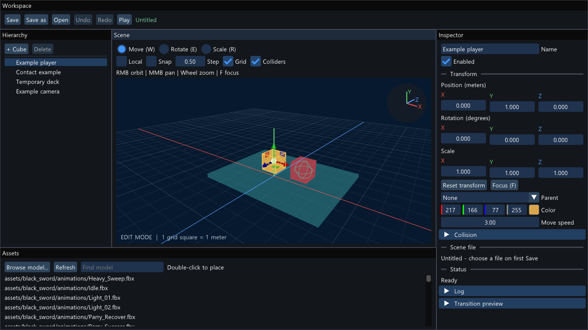

# 10 팀원이 사용하는 장면 편집 흐름

2026-10-06. 완료 기준은 **모델 탐색 → 배치 → 수정 → 복구 → 저장 → 다시 열기**다. 06단계의 최소 기능 검증을 팀원이 사용할 수 있는 편집 흐름으로 확장한다.

후속 변경: 현재 Assets의 폴더 탐색·선택 배치와 별도 Console은 [11단계 안내](11-assets-console.md)를 따른다. 아래 화면은 10단계 당시 기록이며, 현재 Browse...는 파일 선택 후 Place in Scene으로 배치한다.

## 실행과 화면

Visual Studio에서 F5 또는 bin/x64/Release/NereidesSandbox.exe를 실행한다. 기본 모드는 Edit이며 예제 객체가 자동으로 움직이지 않는다.

- 왼쪽 Hierarchy: 객체 선택, 부모·자식 트리, Cube 추가, 선택 객체 삭제.
- 가운데 Scene: 장면만 그리는 별도 렌더 타깃과 편집 전용 카메라.
- 오른쪽 Inspector: 이름, 활성화, XYZ 위치·회전·크기, 부모와 지원 속성.
- 아래 Assets: 프로젝트 assets 폴더의 FBX·OBJ·glTF·GLB 검색과 배치.
- 위 Workspace: Save, Save as, Open, Undo, Redo, Play/Stop.

기본 시점은 비스듬한 3D 시점이다. X는 빨강, Y는 초록, Z는 파랑이다. 격자는 1미터이며 Scene 우측 상단에도 방향을 표시한다. Inspector 회전은 도 단위로 입력하고 내부에는 기존 라디안을 저장한다.

## 팀원이 따라 할 순서

1. Assets 검색창에서 모델 이름을 찾는다. 목록에 없으면 Refresh 또는 Browse model로 파일을 선택한다.
2. 목록을 더블클릭하면 현재 편집 카메라의 주시점에 배치하고 모델에 초점을 맞춘다. 파일을 Scene으로 끌어놓으면 마우스 아래의 Y=0 바닥에 배치한다. 바닥과 교차하지 않으면 주시점 깊이를 사용한다.
3. Scene에서 객체를 클릭하거나 Hierarchy에서 선택한다. Hierarchy 더블클릭 또는 Scene 위에서 F로 선택 객체에 초점을 맞춘다.
4. Scene 위에서 우클릭 드래그로 회전, 가운데 버튼 드래그로 화면 이동, 휠로 확대·축소한다. 편집 카메라를 움직여도 저장되는 게임 카메라는 바뀌지 않는다.
5. Move/Rotate/Scale 또는 W/E/R로 도구를 선택한다. Local 체크를 끄면 월드 기준, 켜면 객체 기준이다. Snap과 Step으로 이동·회전·크기의 스냅 간격을 정한다. 회전 도구의 Step은 도 단위다.
6. Inspector의 색상별 X/Y/Z 칸을 드래그한다. Ctrl+클릭으로 정확한 숫자를 입력할 수 있다. Reset transform은 위치·회전 0, 크기 1로 되돌린다.
7. Undo 또는 Ctrl+Z, Redo 또는 Ctrl+Y로 복구한다. 연속 드래그·텍스트 입력은 편집이 끝날 때 한 이력으로 묶는다. 추가·삭제·부모 관계와 속성 변경도 포함한다.
8. Save 또는 Ctrl+S로 저장한다. 새 세션의 첫 저장은 파일 선택 창을 열고, Save as는 다른 이름으로 저장한다. Open은 JSON 씬을 읽는다. 미저장 변경이 있으면 저장·버리기·취소를 선택한다.
9. Play로 게임 카메라와 예제 동작을 시험한다. Scene 위에서 WASD로 예제 상자를 움직인다. Stop / restore는 실행 직전의 편집 장면으로 돌아온다. 실행 중 배치 편집과 저장은 막는다. 모델을 선택하고 Play한 상태에서는 Inspector의 클립 버튼으로 애니메이션도 확인할 수 있다.

창을 닫을 때 미저장 변경이 있으면 Save and close / Discard and close / Cancel을 표시한다. 최소 창 영역은 900×600이다. 1280×720 이상을 권장한다.

## 복구와 오류

파일을 여는 중 잘못된 JSON, 누락된 모델, 잘못된 부모 관계를 발견하면 현재 장면을 유지하고 Status와 로그에 원인을 표시한다. 파일 저장은 검증 후 임시 파일을 기록하고 교체하므로 실패 시 이전 저장본을 보존한다.

Undo/Redo는 현재 세션에서 최대 64회, 이력 문자열 합계 32 MiB를 기준으로 보관한다. 앱 재실행 후의 복구는 저장된 씬을 Open하는 방식이다. 자동 저장·충돌 복구 파일은 이번 범위에 포함하지 않는다. 외부 모델 원본이 삭제되면 해당 모델이 필요한 복구도 실패할 수 있으므로 공유 에셋은 별도로 보존한다.

게임 카메라와 플레이어, 그 조상을 삭제해 필수 역할을 끊는 작업은 막는다. 부모 변경은 로컬 변환을 유지하므로 화면상 위치가 달라질 수 있다. 비균일 크기의 부모 아래에서 기즈모가 만드는 shear는 일반 TRS로 완전히 보존하지 못한다.

## 구조 읽기

- Editor.cpp: 화면 구성, 모델 검색/파일 선택, 입력, 편집 전용 카메라, 기즈모와 저장·복구 흐름.
- EditHistory.h, SceneIO.cpp: 장면 스냅샷과 저장 지점 관리.
- EditorGeometry.h: 스키닝과 부모 변환을 반영한 범위, 객체 선택과 Focus.
- D3D11Renderer.cpp: Scene 전용 색상/깊이 텍스처, 뷰포트 크기 변경, UI 표시.
- Application.cpp: Edit/Play 시간·입력, 게임 장면 렌더 데이터에 편집 카메라 적용.
- EditorWorkflowTests.cpp: 실제 ImGui 클릭·키 입력으로 작업 흐름 검증.

Scene 렌더 결과를 먼저 만들고 UI 패스에서 텍스처로 표시한다. Scene의 크기와 투영 종횡비는 창 전체 크기와 분리한다. 편집 카메라·검색어·선택 상태는 게임 씬 데이터에 저장하지 않는다.

## 검증 기록

./scripts/verify.ps1이 Debug/Release를 빌드하고 기존 회귀와 아래 검증을 실행한다.

- --editor-workflow-test: Cube 추가, Z값 입력, Undo/Redo, 삭제 복구, 모델 목록 더블클릭 배치, 한글 모델 경로 직렬화, 휠·Focus, Ctrl+S, Play 중 변화 후 Stop 복구, 미저장 종료 차단.
- --editor-smoke-test: 별도 Scene 텍스처의 실제 GPU 픽셀과 에디터 화면 캡처.
- --editor-resize-smoke-test: 1280×720 → 900×600 → 1280×720의 실제 창 크기 변경과 GPU 출력.
- --engine-tests: 부모·자식 복구, 저장 상태와 이력 분기, 선택 범위, 저장 실패 보존.

2026-10-06 Debug와 Release 모두 빌드 및 8개 검증 모드를 통과했다. UI 검증은 실제 ImGui 마우스·키 입력으로 수행하며, 드래그 배치 후 바닥 위치와 Undo, 편집 카메라 회전/이동 후 게임 장면 불변도 확인했다. 1280×720 편집 화면, 한글 모델 이름과 미저장 종료 창, 900×600 크기 변경 화면을 GPU 캡처로 확인했다. Windows 기본 파일 선택 창의 모든 수동 조작과 모든 기즈모 드래그 조합까지 자동 검증한 것은 아니다.

Release 배포 폴더 dist/Nereides-editor-stage10에서도 --editor-workflow-test와 --editor-smoke-test를 통과했다. 실행 파일·의존 DLL·라이선스 고지·data·사용 문서를 포함하며 외부 모델은 자동 복사하지 않는다. 이는 개발 PC에서의 패키지 검증이고 다른 PC에서의 검증은 아니다.

## 남은 범위

렌더러는 기본색·스키닝 검증 백엔드다. 최종 텍스처·재질·조명·그림자와 Sherlock 포팅은 별도다. 선택은 화면 Ray와 객체 바운딩 박스의 교차이므로 삼각형 단위 정밀 선택은 아니다. 격자·선택선·충돌선은 깊이 차폐가 없는 편집 오버레이다. 패널 도킹·다중 선택·모델 썸네일·범용 사용자 컴포넌트 편집·자동 저장은 후속 기능이다.

v1.6의 고정 tick, 영속 객체 구역 교체, 오디오 전체가 이 에디터 작업으로 완료된 것은 아니다. 단계 01~08의 역사적 완료 기록과 이후 기획 변경을 구분한다.
