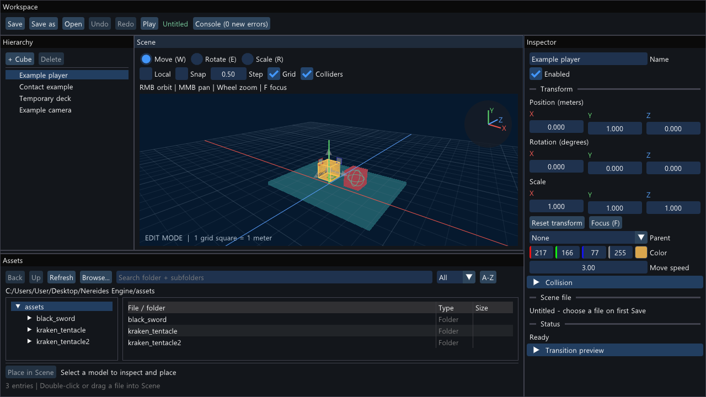
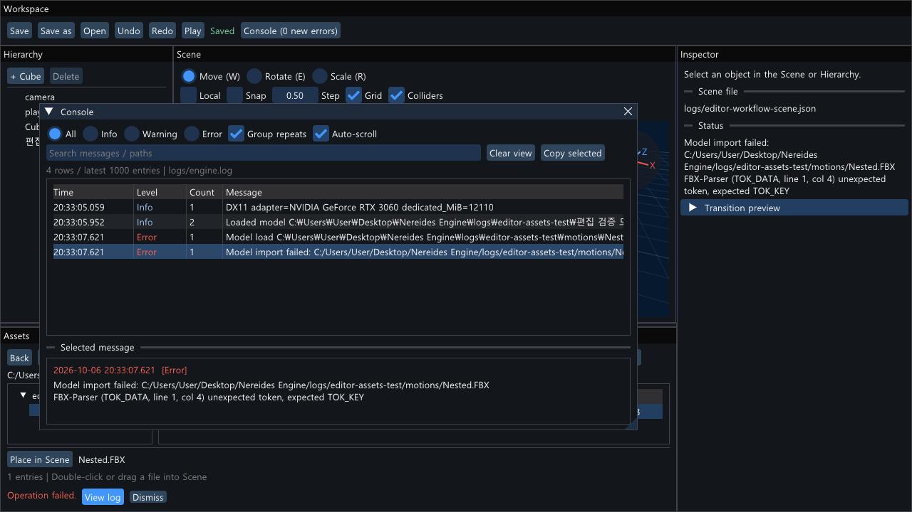

# 11 Assets 탐색과 별도 Console

2026-10-06. 팀원이 모델을 찾고 선택한 뒤 배치하며, 오류 원인을 편집 화면과 분리해서 읽도록 개선했다. 이 단계의 코드는 `stage-11` 커밋 메시지로 찾는다.

## 모델 찾기와 배치

아래 Assets는 왼쪽 폴더 트리, 오른쪽 파일 목록, 아래 선택 정보로 구성된다. 목록에는 짧은 파일 이름·형식·파일 크기를 표시하며, 이름에 마우스를 올리면 전체 경로를 확인할 수 있다.

1. 왼쪽 폴더를 누르거나 오른쪽 폴더를 더블클릭한다. Back은 이전 폴더, Up은 상위 폴더로 이동한다. 탐색 범위는 프로젝트 또는 배포 폴더의 assets 아래다.
2. Search는 현재 폴더와 하위 폴더의 이름·상대 경로를 검색한다. 비우면 현재 폴더의 항목만 표시한다. 한글 이름을 지원하고 영문 대소문자는 구분하지 않는다.
3. All / FBX / OBJ / glTF / GLB로 형식을 고르고 A-Z / Z-A로 이름순을 바꾼다. 폴더는 항상 먼저 표시하며, 형식 필터를 켜도 탐색할 수 있다.
4. 파일을 한 번 클릭하면 선택만 한다. 아래 **Place in Scene**을 누르면 현재 시점의 주시점에 배치하고 모델에 초점을 맞춘다. 파일 더블클릭과 Scene으로 드래그하는 기존 방식도 사용할 수 있다.
5. **Browse...**는 assets 밖의 모델을 선택한다. 선택 후 **Place in Scene**을 눌러 배치한다. 외부 파일을 프로젝트로 복사하지는 않는다.
6. 실제 로딩에 성공한 파일은 아래에 `Last import: 메시 수 / 클립 수`를 표시한다. 목록을 보여주기 위해 모든 모델을 미리 로딩하지 않는다.
7. Scene과 Assets 사이의 가로 경계를 위아래로 끌면 Assets 높이를 바꿀 수 있다.

파일을 추가하거나 옮겼으면 **Refresh**로 목록을 다시 읽는다. Refresh는 표시된 최근 로딩 정보도 초기화하지만, 장면에 배치된 모델이나 모델 캐시를 다시 로딩하지 않는다. Play 중에는 탐색은 가능하고 배치는 비활성화된다. 배치 후 Undo/Redo·저장·Play/Stop 조작은 [10단계 안내](10-editor-workflow.md)를 따른다.

## 로그 확인

상단 **Console** 버튼으로 별도 창을 열고 닫는다. 닫혀 있는 동안 발생한 Error 수는 버튼 옆에 표시된다. Console은 에디터 내부에서 이동·크기 조절·접기가 가능한 창이다. Inspector의 Status는 최근 작업 결과를 계속 보여준다.

- **All / Info / Warning / Error**: 심각도별 표시. Search는 메시지·경로·시각을 검색한다.
- **Group repeats**: 같은 심각도와 같은 메시지를 한 행으로 묶는다. Count는 횟수, Time은 마지막 발생 시각이다.
- **Auto-scroll**: 목록 맨 아래에 있을 때 새 로그를 따라간다. 위로 스크롤하면 과거 기록을 읽을 수 있고, 다시 맨 아래로 내려가면 따라간다.
- 행 선택: 아래 Selected message에서 전체 경로와 여러 줄 원인을 읽는다. 긴 줄은 가로 스크롤할 수 있다. **Copy selected**는 선택한 메시지를 시각·심각도와 함께 클립보드에 복사한다.
- **Clear view**: 지금까지의 기록을 화면에서 숨긴다. 이후 로그는 계속 표시하며 `logs/engine.log`는 지우지 않는다.

모델 로딩이나 편집 작업이 실패하면 Assets 아래에 **Operation failed. / View log / Dismiss**가 표시된다. **View log**는 Console을 열고 필터를 초기화하여 해당 오류를 선택한다. Dismiss는 안내 표시만 닫는다. 잘못된 모델 파일을 배치해도 기존 장면은 유지된다.

Console은 **현재 실행에서 최근 1,000건**을 보관한다. 화면에서 묶어도 파일에는 발생 건별로 남는다. 지난 실행 기록은 파일에서 확인하며, 오래되어 메모리에서 빠진 오류를 View log로 요청하면 파일 확인 안내를 표시한다. 파일 로그는 실행 기준 폴더의 `logs/engine.log`에 추가 기록된다. 시각은 PC의 로컬 시각이며 로그 ID는 실행마다 새로 시작한다.

## 구조 읽기

1. `src/Editor/AssetBrowser.h/.cpp`: 폴더 인덱스, 범위 검색·형식 필터·정렬, 선택과 배치 요청. 실제 장면 변경은 Editor에 맡긴다.
2. `src/Core/Log.h/.cpp`: 시각·심각도·메시지·단조 증가 ID, 최근 기록 스냅샷과 파일 출력. `Log::Write`가 반환한 ID로 오류 위치를 연결한다.
3. `src/Editor/Console.h/.cpp`: 검색·그룹화, 선택 상세·복사, 표시 초기화와 오류 이동. 화면 필터는 원본 로그를 변경하지 않는다.
4. `src/Editor/Editor.cpp`: 패널 배치와 높이 조절, Console 버튼, 안전한 배치 콜백, 실패 메시지 연결. Console 뒤의 Scene 기즈모는 마우스 입력을 받지 않도록 제한한다.
5. `src/Tests/EngineTests.cpp`, `src/Tests/EditorWorkflowTests.cpp`: 로그 데이터 검증과 실제 ImGui 입력을 사용하는 편집 흐름 검증.

## 검증

`./scripts/verify.ps1`로 Debug·Release 각각 8개 모드를 검증한다.

- 로그 ID·시각, 심각도·검색, 같은 메시지의 그룹화와 횟수, 오래된 반복 항목의 오류 선택, Clear 이후 경계를 확인한다.
- 실제 ImGui 마우스·키 입력으로 폴더 더블클릭·Back·하위 폴더 검색·검색 결과 없음, 한 번 선택과 명시적 배치, 메시 정보 표시를 확인한다.
- 잘못된 FBX 배치 후 장면 보존, View log의 정확한 오류 선택, Error 필터, Clear view 후 파일 보존과 새 오류 표시, Console 토글, Assets 경계 드래그를 확인한다.
- 기존 Z 수정·Undo/Redo·한글 경로·드래그 배치·저장·Play/Stop·종료 보호 및 GPU·창 크기 변경 회귀도 함께 실행한다.

2026-10-06 Debug·Release 빌드와 각각 8개 검증 모드를 통과했다. UI 테스트는 숨겨진 Windows 창에 실제 ImGui 입력을 공급하며 GPU 캡처를 남긴다. OS 파일 선택 창의 모든 조작이나 모든 수동 제스처를 자동 검증한 것은 아니다.

1280×720 Assets·Console 화면과 900×600 크기 변경 출력을 캡처로 확인했다. `dist/Nereides-editor-stage11` 배포 폴더에서도 `--editor-workflow-test`와 `--editor-smoke-test`를 통과했다. 실행 파일·DLL·라이선스·data·문서를 포함하며 외부 모델은 자동 복사하지 않는다. 배포 확인은 이 개발 PC에서 수행했다.

## 현재 범위

썸네일, 즐겨찾기, 파일 변경 자동 감지, 모델 재임포트, Assets에서 파일 삭제·이동, 모션 리타게팅은 포함하지 않는다. 파일 탐색은 최대 10,000항목·깊이 48로 제한한다. Console을 운영체제의 별도 창으로 분리하거나 패널을 자유롭게 도킹하는 기능도 후속 범위다. 에셋 경로와 원본 파일은 기존처럼 팀원이 함께 관리해야 한다.
